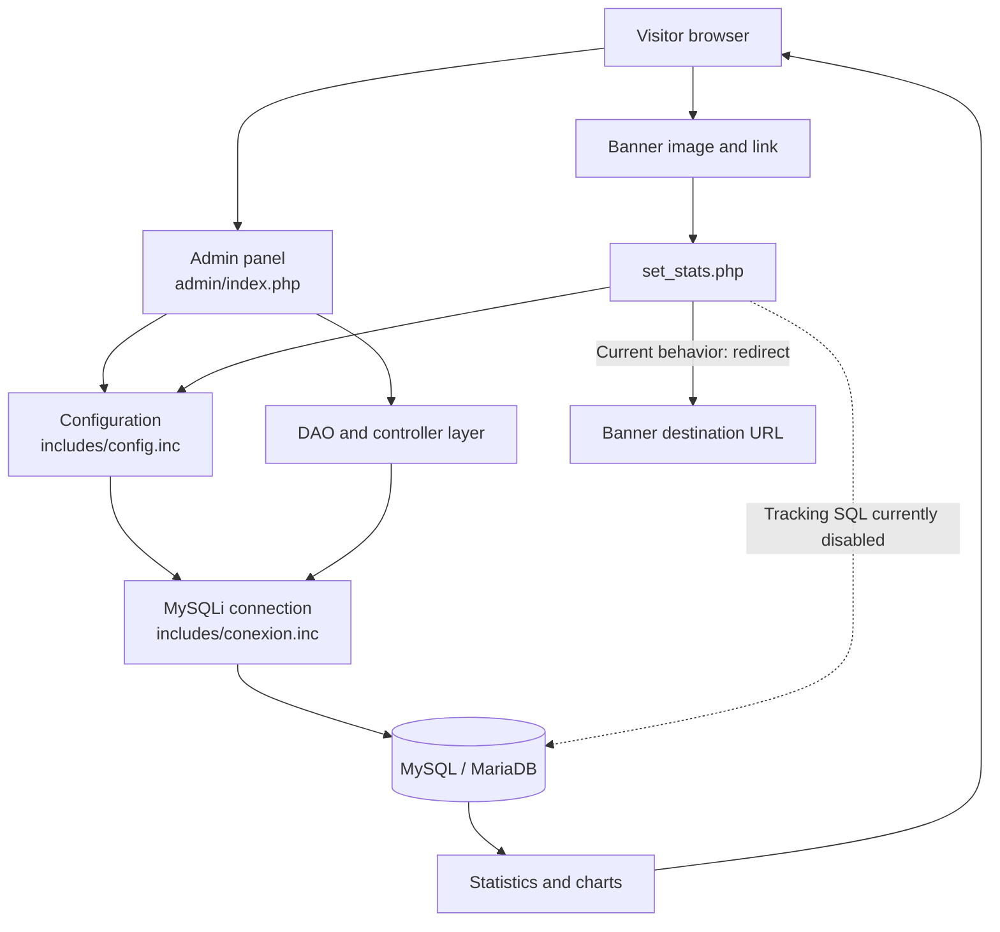

# Ad Manager

A PHP application for managing advertising banners, companies, users, and statistics.

## Requirements

- PHP 7 or later with the `mysqli` extension enabled.
- MySQL or MariaDB.
- Apache, Nginx, or another PHP-compatible web server.
- The project's database and tables.

## Configuration

1. Copy the configuration template:

   ```powershell
   Copy-Item includes/config_template.inc includes/config.inc
   ```

2. Edit `includes/config.inc` and fill in these values:

   ```php
   $host = 'localhost';
   $user = 'database_user';
   $pass = 'database_password';
   $db = 'database_name';
   ```

`includes/config.inc` contains credentials and is excluded from the repository through `.gitignore`. Do not commit it to Git.

## Database setup

The inferred database scripts are in the `database/` directory:

- `database/schema.sql`: creates the five tables owned by Ad Manager.
- `database/sample_data.sql`: inserts a company, an admin user, a banner, and sample statistics.

Run them against the configured database in this order:

```powershell
mysql -u database_user -p database_name < database/schema.sql
mysql -u database_user -p database_name < database/sample_data.sql
```

The statistics report also joins `phpbb_forums` using `forum_id` and `forum_name`. That table belongs to the existing phpBB installation and is intentionally not created by the project schema. The sample data uses `foroID = 0`, so it does not require phpBB rows for the initial setup.

The sample login is `admin` with password `change-me`. Change it immediately and use password hashing before deploying to production.

## Local execution

Place the project in your web server's public directory and open:

```text
http://localhost/ad_manager/admin/index.php
```

You can also use PHP's built-in server from the project root:

```powershell
php -S localhost:8000
```

Then visit:

```text
http://localhost:8000/admin/index.php
```

## Main structure

- `admin/`: administration panel, DAOs, classes, statistics, and charts.
- `banners/`: banner images.
- `images/`: general images.
- `includes/`: database connection, configuration, and advertising components.
- `javascript/`: public site scripts.
- `styles/`: stylesheets.
- `database/`: inferred database schema and sample data.
- `set_stats.php`: handles banner clicks and redirects to the destination.

## Entry points

- `admin/index.php`: admin panel login.
- `admin/n4_banners.php`: banner management.
- `admin/n4_estadisticas.php`: statistics viewer.
- `admin/charts.php`: charts.
- `set_stats.php`: banner click endpoint and redirection.

## Component flow



## `set_stats.php`

`set_stats.php` is the endpoint used when a visitor clicks a banner. It receives the banner, company, destination URL, forum, and topic identifiers, ensures the destination has an HTTP scheme, and redirects the visitor to that destination.

The SQL statements intended to increment click counters and insert detailed statistics are currently commented out in the file. Therefore, the current effective behavior is URL preparation and redirection; it does not persist click statistics until those statements are enabled and tested. The script also expects `includes/config.inc` to provide the database connection.

Banner image files are stored locally in `banners/` and are excluded from Git. They must be provisioned separately on each deployment.

## Validation

To validate the PHP syntax of all files, run this from the project root:

```powershell
Get-ChildItem -Recurse -Filter *.php | ForEach-Object { php -l $_.FullName }
```

Do not store real credentials in the repository or in publicly accessible server files.
